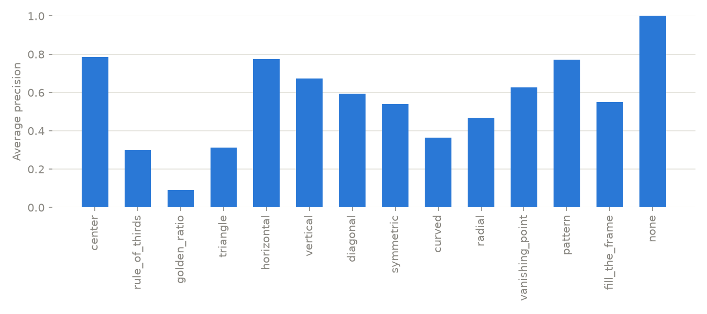

# Photography Composition Analyzer

A computer-vision application that analyzes a photograph and predicts which photographic composition techniques are present.
The model is a fine-tuned EfficientNetB0 trained on the [CADB dataset](https://github.com/bcmi/Image-Composition-Assessment-Dataset-CADB) (9,497 images) to perform multi-label classification over 14 composition classes:
center, rule of thirds, golden ratio, triangle, horizontal, vertical, diagonal, symmetric, curved, radial, vanishing point, pattern, fill the frame, and none.

A single photograph can use several techniques at once (for example rule of thirds and diagonal), so the model outputs an independent sigmoid probability per technique instead of choosing one class.


## Results

Trained with two-stage transfer learning: the classification head is trained first with the ImageNet-pretrained backbone frozen, then the last two EfficientNet blocks are fine-tuned at a lower learning rate.
Splits are image-level and deterministic: the official CADB test split (950 images) is held out untouched, and a hash-based 10% validation split (899 images) is carved from the remaining 8,547 training images.
Per-class decision thresholds are selected on the validation set and stored with the model.

Held-out test set (950 images):

| Metric | Score |
|---|---|
| mAP (macro average precision) | **0.561** |
| Macro F1 | **0.474** |
| Micro F1 | **0.558** |

Fine-tuning helps substantially: validation PR-AUC is 0.437 with the backbone fully frozen (Baseline A) versus 0.574 after fine-tuning the last two blocks (Model B).

Per-class test results:

| Class | Support | AP | Precision | Recall | F1 |
|---|---|---|---|---|---|
| center | 451 | 0.786 | 0.623 | 0.907 | 0.738 |
| rule_of_thirds | 113 | 0.298 | 0.291 | 0.469 | 0.359 |
| golden_ratio | 39 | 0.091 | 0.050 | 0.385 | 0.089 |
| triangle | 48 | 0.314 | 0.395 | 0.354 | 0.374 |
| horizontal | 246 | 0.773 | 0.692 | 0.703 | 0.698 |
| vertical | 182 | 0.673 | 0.478 | 0.769 | 0.590 |
| diagonal | 201 | 0.593 | 0.551 | 0.537 | 0.544 |
| symmetric | 54 | 0.539 | 0.643 | 0.333 | 0.439 |
| curved | 57 | 0.364 | 0.429 | 0.263 | 0.326 |
| radial | 6 | 0.468 | 0.500 | 0.500 | 0.500 |
| vanishing_point | 27 | 0.627 | 0.439 | 0.667 | 0.529 |
| pattern | 21 | 0.772 | 0.500 | 0.857 | 0.632 |
| fill_the_frame | 66 | 0.549 | 0.386 | 0.667 | 0.489 |
| none | 2 | 1.000 | 0.200 | 1.000 | 0.333 |



### Example predictions

Correct, ambiguous (one label off), and failure cases from the test set:


### Known failure modes

- **Golden ratio** is the weakest class (AP 0.09).
  It is visually close to rule of thirds, and the model confuses the two heavily.
  Even human annotators disagree here, since both rules place the subject slightly off-center.
- **Curved** compositions have low recall (0.26).
  Curves are often subtle leading lines that are hard to detect at 224x224 resolution.
- **Rare classes** (radial with 6 test positives, none with 2) have very noisy thresholds and metrics because the validation set contains only a handful of positives to tune on.
- Class imbalance is severe overall (center has 4,804 positives, radial only 42), which is why training uses positive-class-weighted binary cross-entropy and evaluation focuses on macro metrics and mAP rather than accuracy.

Label co-occurrence on the test set and training curves:


## Setup

Requires Python 3.12 (TensorFlow does not yet support newer interpreters).

```bash
python3.12 -m venv .venv
.venv/bin/pip install -r requirements.txt
./scripts/download_cadb.sh   # downloads and extracts CADB (~2GB) into data/CADB_Dataset
```

On Apple Silicon, `tensorflow-metal` is installed automatically for GPU training.
Note that TensorFlow is pinned to 2.19 because tensorflow-metal 1.2.0 is incompatible with newer TensorFlow releases.

## Usage

All commands run from the repository root with the venv active.

Train (two stages, best checkpoint kept by validation PR-AUC, about 15 minutes on an M2 Max GPU):

```bash
python -m src.train --data-root data/CADB_Dataset --output-dir artifacts
```

Select per-class thresholds on the validation set, then run the one-time test evaluation:

```bash
python -m src.evaluate --split val --select-thresholds
python -m src.evaluate --split test
```

Predict composition techniques for any local photo, optionally saving a copy with a rule-of-thirds grid and the predicted labels:

```bash
python -m src.inference photo.jpg --overlay out/
```

Run the demo app (upload a JPG or PNG, see confidence bars and an optional rule-of-thirds overlay):

```bash
uvicorn api.main:app --port 8000
# then open http://localhost:8000
```

The API itself is a single endpoint: `POST /api/predict` with a multipart `file` field returns per-class probabilities, thresholds, and which techniques were detected.

## Repository structure

```text
src/data.py           # annotation parsing, splits, tf.data pipeline
src/model.py          # EfficientNetB0 backbone + multi-label head, weighted BCE
src/train.py          # two-stage training with checkpointing
src/evaluate.py       # metrics, threshold selection, reports and plots
src/inference.py      # single-image prediction CLI with overlay output
api/main.py           # FastAPI inference endpoint + demo page serving
app/index.html        # drag-and-drop demo frontend
scripts/download_cadb.sh
data/                 # local dataset (not committed)
artifacts/            # trained model, thresholds, reports (not committed)
docs/                 # plots and screenshots used in this README
```

## Notes

Composition labels are subjective.
Predictions reflect the consensus of CADB annotators, not objective ground truth, and the model can both miss and over-detect techniques.
