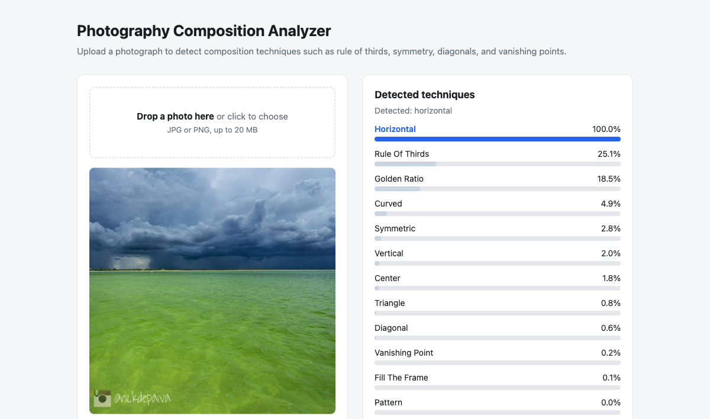
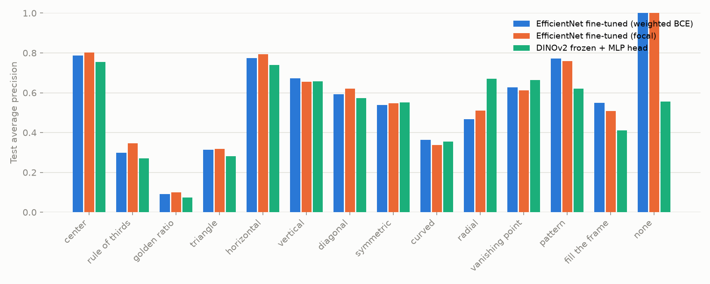
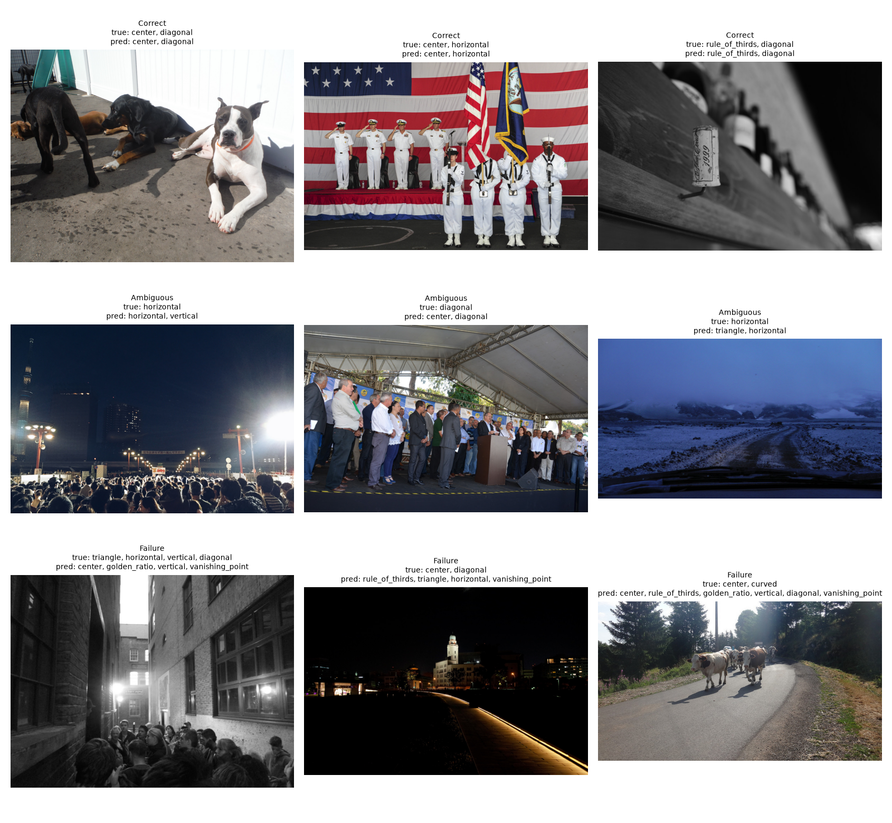
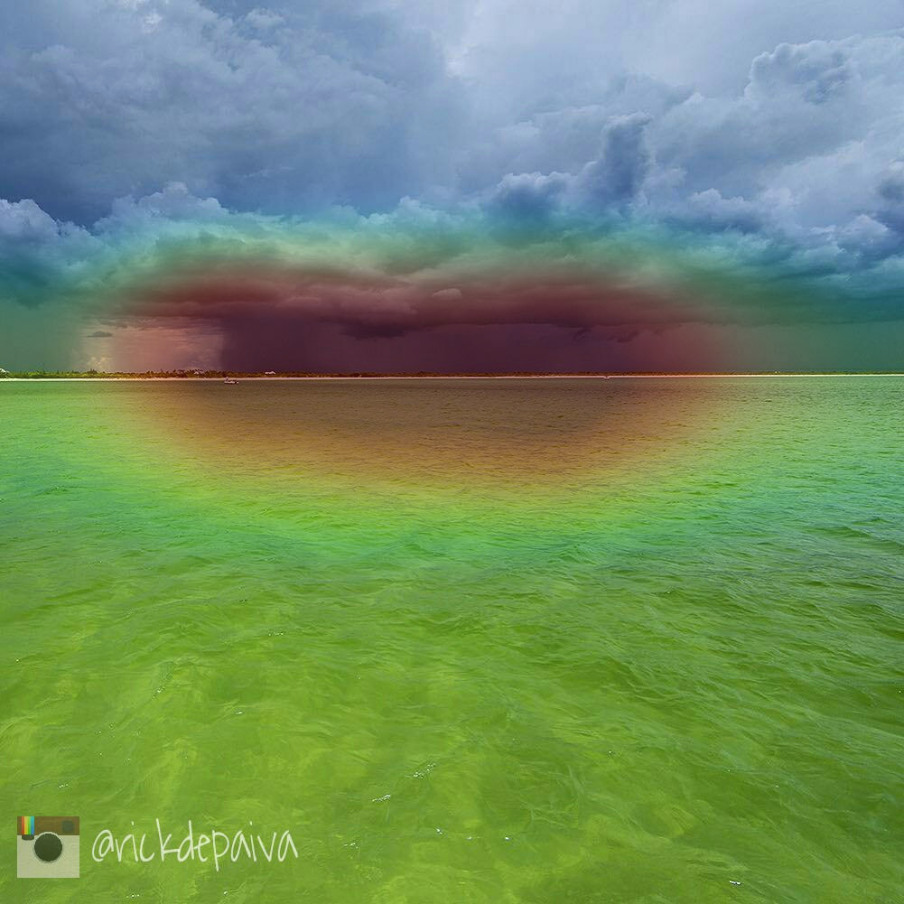
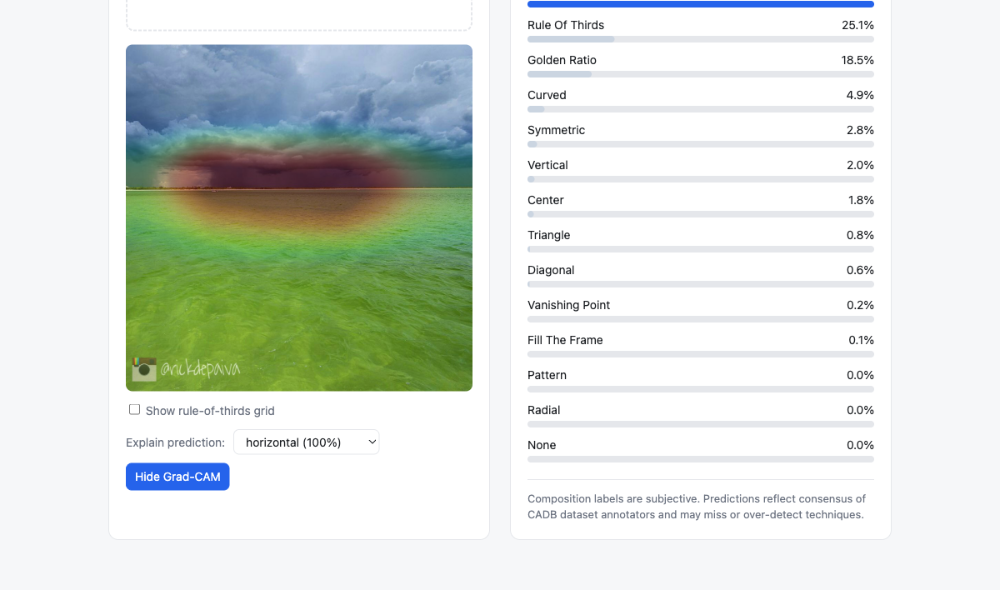
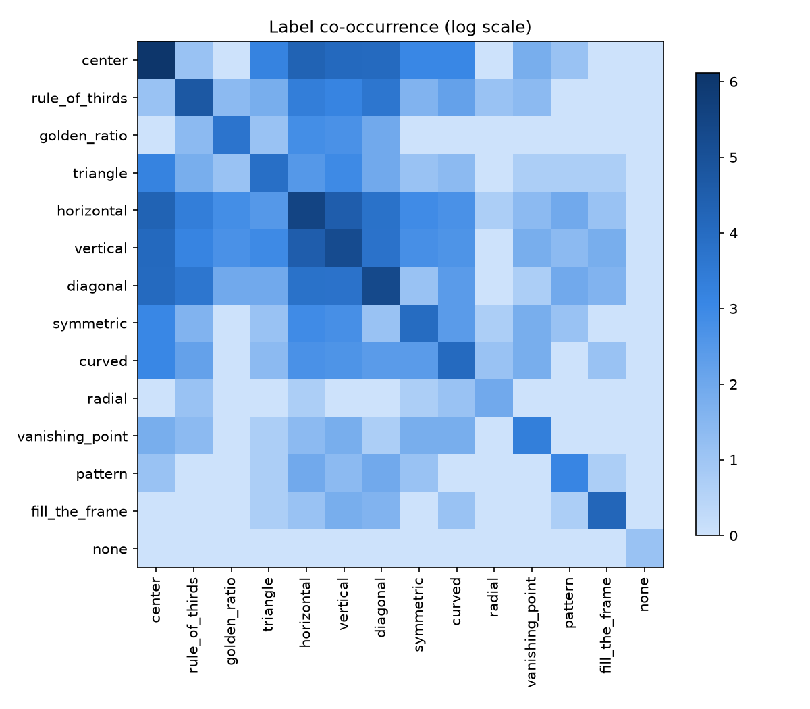
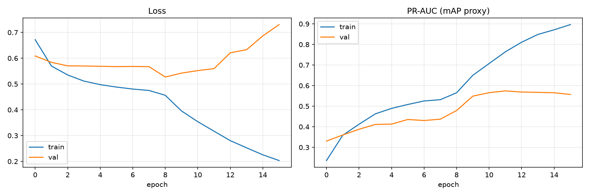

# Photography Composition Analyzer

An investigation into how different computer-vision approaches recognize photographic composition.
The core task is multi-label classification: given a photograph, predict which of 14 composition techniques are present
(center, rule of thirds, golden ratio, triangle, horizontal, vertical, diagonal, symmetric, curved, radial, vanishing point, pattern, fill the frame, or none).
A single photograph can use several techniques at once, so the models output an independent sigmoid probability per technique.

All experiments use the [CADB dataset](https://github.com/bcmi/Image-Composition-Assessment-Dataset-CADB) (9,497 annotated photographs), the same deterministic splits, the same metrics, and the same per-class threshold selection, so results are directly comparable:

- A fine-tuned **EfficientNetB0** CNN (the main model, served in the demo).
- A frozen **DINOv2 ViT-S/14** with a small trained head, comparing self-supervised ViT representations against supervised CNN transfer learning.
- A **weighted BCE vs focal loss** ablation targeting the dataset's severe class imbalance.
- **Grad-CAM** explanations showing which image regions drive each prediction.



## Experiments

Held-out test set (950 images, official CADB test split):

| Experiment | Model | Loss | Training | Test mAP | Macro F1 | Micro F1 |
|---|---|---|---|---:|---:|---:|
| A | EfficientNetB0 | Weighted BCE | Frozen backbone | 0.474 | 0.404 | 0.525 |
| B | EfficientNetB0 | Weighted BCE | Fine-tuned (last 2 blocks) | 0.561 | 0.474 | 0.558 |
| C | EfficientNetB0 | Focal (alpha 0.25, gamma 2) | Fine-tuned (last 2 blocks) | **0.565** | **0.507** | 0.597 |
| D | DINOv2 ViT-S/14 | Weighted BCE | Frozen + MLP head | 0.513 | 0.482 | **0.599** |
| E | DINOv2 ViT-S/14 | Weighted BCE | Frozen + linear probe | 0.509 | 0.451 | 0.554 |
| F | DINOv2 ViT-S/14 | Focal (alpha 0.25, gamma 2) | Frozen + MLP head | 0.467 | 0.417 | 0.564 |
| G | DINOv2 ViT-B/14 | Weighted BCE | Frozen + MLP head | 0.500 | 0.469 | 0.570 |

Per-class average precision for the three strongest models:



### Findings

**Fine-tuning matters.**
Unfreezing just the last two EfficientNet blocks lifts test mAP from 0.474 to 0.561 (A vs B).
ImageNet features alone under-represent the geometric cues composition depends on.

**Focal loss helps rare classes without hurting mAP.**
Focal loss ties weighted BCE on mAP (0.565 vs 0.561) but wins clearly on macro F1 (0.507 vs 0.474) and micro F1 (0.597 vs 0.558).
The gains concentrate in rare classes: radial F1 0.60 vs 0.50, none 0.57 vs 0.33, symmetric 0.52 vs 0.44, with vertical and diagonal also improving.
Neither loss fixes golden ratio (AP about 0.09 either way); that failure is about label ambiguity, not the loss.

**Self-supervised features transfer better frozen, but lose to a fine-tuned CNN.**
Frozen DINOv2 with only a small MLP head (0.513 mAP) beats frozen EfficientNet (0.474) by a wide margin, which is the expected strength of self-supervised representations.
It still trails the fine-tuned CNN overall, but wins on classes defined by global geometric structure: radial (AP 0.671 vs 0.468), vanishing point (0.664 vs 0.627), and symmetric (0.552 vs 0.539).
A plausible reading is that ViT global attention captures whole-frame geometry that CNN features only learn when fine-tuned.

**DINOv2 features are nearly linearly separable for this task.**
A pure linear probe (E) reaches 0.509 mAP versus 0.513 for the MLP head (D).
The hidden layer buys almost nothing in ranking quality; its contribution is macro F1 (0.482 vs 0.451), mostly via rare classes.

**Focal loss is not a universal win.**
The same focal configuration that improves the fine-tuned CNN (C vs B) clearly hurts the frozen DINOv2 head (F vs D: mAP 0.467 vs 0.513, macro F1 0.417 vs 0.482), eroding exactly the rare-class advantage it is meant to protect (radial AP drops from 0.671 to 0.447).
When the backbone can adapt, down-weighting easy examples redirects representation learning toward hard ones; when only a small head is trainable, per-class weighted BCE is the better-calibrated signal.

**A bigger frozen backbone does not help.**
ViT-B/14 (G, 0.500 mAP) performs slightly below ViT-S/14 (D, 0.513) despite twice the embedding width.
With about 7,600 training images and a frozen backbone, the bottleneck is the head and the data, not representation capacity.

### Main model per-class results (Experiment B, served in the demo)

| Class | Support | AP | Precision | Recall | F1 |
|---|---|---|---|---|---|
| center | 451 | 0.786 | 0.623 | 0.907 | 0.738 |
| rule_of_thirds | 113 | 0.298 | 0.291 | 0.469 | 0.359 |
| golden_ratio | 39 | 0.091 | 0.050 | 0.385 | 0.089 |
| triangle | 48 | 0.314 | 0.395 | 0.354 | 0.374 |
| horizontal | 246 | 0.773 | 0.692 | 0.703 | 0.698 |
| vertical | 182 | 0.673 | 0.478 | 0.769 | 0.590 |
| diagonal | 201 | 0.593 | 0.551 | 0.537 | 0.544 |
| symmetric | 54 | 0.539 | 0.643 | 0.333 | 0.439 |
| curved | 57 | 0.364 | 0.429 | 0.263 | 0.326 |
| radial | 6 | 0.468 | 0.500 | 0.500 | 0.500 |
| vanishing_point | 27 | 0.627 | 0.439 | 0.667 | 0.529 |
| pattern | 21 | 0.772 | 0.500 | 0.857 | 0.632 |
| fill_the_frame | 66 | 0.549 | 0.386 | 0.667 | 0.489 |
| none | 2 | 1.000 | 0.200 | 1.000 | 0.333 |

Rare-class rows (radial with 6 test positives, none with 2) are noisy; treat them as indicative only.

### Example predictions

Correct, ambiguous (one label off), and failure cases from the test set:



### Known failure modes

- **Golden ratio** is the weakest class for every model (AP 0.07 to 0.10).
  It is visually close to rule of thirds and the models confuse the two heavily.
  Even human annotators disagree here, since both rules place the subject slightly off-center.
- **Curved** compositions have low recall for all models.
  Curves are often subtle leading lines that are hard to detect at 224x224 resolution.
- **Rare classes** have very noisy thresholds because the validation set contains only a handful of positives to tune on.
- Class imbalance is severe overall (center has 4,804 positives, radial only 42), which is why evaluation focuses on macro metrics and mAP rather than accuracy.

## Grad-CAM explainability

Grad-CAM back-propagates a class score to EfficientNet's final convolutional feature map to show which regions drove the prediction.
For this storm seascape, the `horizontal` prediction (probability 1.00) is driven almost entirely by the horizon band:



In the demo, pick any predicted class from the "Explain prediction" dropdown and click "Show Grad-CAM" to overlay the heatmap:



Label co-occurrence on the test set and training curves for the main model:




## Setup

Requires Python 3.12 (TensorFlow does not yet support newer interpreters).

```bash
python3.12 -m venv .venv
.venv/bin/pip install -r requirements.txt
./scripts/download_cadb.sh   # downloads and extracts CADB (~2GB) into data/CADB_Dataset
```

On Apple Silicon, `tensorflow-metal` is installed automatically for GPU training.
Note that TensorFlow is pinned to 2.19 because tensorflow-metal 1.2.0 is incompatible with newer TensorFlow releases.
PyTorch is used only to extract DINOv2 embeddings.

## Usage

All commands run from the repository root with the venv active.

Train the EfficientNet model (two stages, best checkpoint kept by validation PR-AUC, about 15 minutes on an M2 Max GPU):

```bash
python -m src.train --data-root data/CADB_Dataset --output-dir artifacts
python -m src.train --output-dir artifacts_focal --loss focal          # focal loss variant
python -m src.train --output-dir artifacts_frozen --unfreeze-blocks 0  # frozen baseline
```

Select per-class thresholds on the validation set, then run the one-time test evaluation:

```bash
python -m src.evaluate --split val --select-thresholds
python -m src.evaluate --split test
```

Run the DINOv2 experiments (embeddings are extracted once, then only the head trains):

```bash
python -m src.dinov2 extract
python -m src.dinov2 train
python -m src.dinov2 evaluate --split val --select-thresholds
python -m src.dinov2 evaluate --split test
```

Variants reuse the cached embeddings via `--embeddings-from`:

```bash
python -m src.dinov2 train --head linear --embeddings-from artifacts_dinov2 --model-dir artifacts_dinov2_linear
python -m src.dinov2 train --loss focal --embeddings-from artifacts_dinov2 --model-dir artifacts_dinov2_focal
python -m src.dinov2 extract --arch dinov2_vitb14 --model-dir artifacts_dinov2b   # ViT-B/14
```

Predict composition techniques for any local photo, and generate Grad-CAM explanations:

```bash
python -m src.inference photo.jpg --overlay out/
python -m src.gradcam photo.jpg rule_of_thirds -o heatmap.png
```

Run the demo app (upload a JPG or PNG, see confidence bars, a rule-of-thirds overlay, and Grad-CAM):

```bash
uvicorn api.main:app --port 8000
# then open http://localhost:8000
```

The API has two endpoints: `POST /api/predict` returns per-class probabilities and detected techniques, and `POST /api/gradcam` (multipart `file` plus a `label` field) returns a heatmap overlay PNG.

## Repository structure

```text
src/data.py             # annotation parsing, splits, tf.data pipeline
src/model.py            # EfficientNetB0 + multi-label head, weighted BCE and focal loss
src/train.py            # two-stage training with checkpointing
src/evaluate.py         # metrics, threshold selection, reports and plots
src/inference.py        # single-image prediction CLI with overlay output
src/gradcam.py          # Grad-CAM heatmaps (CLI + library)
src/dinov2.py           # DINOv2 linear-probe experiment (extract / train / evaluate)
api/main.py             # FastAPI endpoints + demo page serving
app/index.html          # drag-and-drop demo frontend
scripts/download_cadb.sh
scripts/plot_comparison.py
data/                   # local dataset (not committed)
artifacts*/             # per-experiment models, thresholds, reports (not committed)
docs/                   # plots and screenshots used in this README
```

## Notes

Composition labels are subjective.
Predictions reflect the consensus of CADB annotators, not objective ground truth, and the models can both miss and over-detect techniques.
